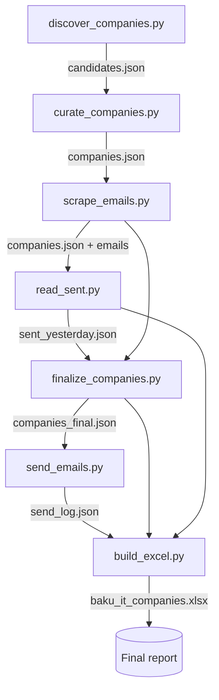

# job-finder

An automated outreach pipeline for a targeted job search. It **discovers** IT and
software companies in Baku, Azerbaijan, **scrapes** their contact and HR email
addresses, **de-duplicates** against people already contacted, **emails** each one
a CV, and produces a tidy **Excel report** of exactly who was reached and how.

The whole thing is a handful of small, single-purpose Python scripts that pass
data to each other through JSON files. Every external API call is cached to disk,
so re-runs and crash recovery cost zero credits, and every email send is logged
the instant it happens, so an interruption never sends a duplicate.

> **Heads up — outreach automation.** This tool sends real email to real
> companies. Use it for your own genuine job search, respect each site's terms
> and `robots.txt`, keep volumes low, and never use it for bulk/spam outreach.
> Discovered addresses are business contacts scraped from public pages; treat
> them accordingly.

---

## How it works



| Stage | Script | Input | Output | External APIs |
|-------|--------|-------|--------|---------------|
| 1. Discover | `discover_companies.py` | search queries + directory pages | `candidates.json` | Serper, Firecrawl |
| 2. Curate | `curate_companies.py` | `candidates.json` | `companies.json` | Serper |
| 3. Scrape emails | `scrape_emails.py` | `companies.json` | `companies.json` (enriched) | Firecrawl, Serper, direct HTTP |
| 4. Read Sent mail | `read_sent.py` | Gmail Sent folder | `sent_yesterday.json` | Gmail IMAP |
| 5. Finalize | `finalize_companies.py` | `companies.json`, `sent_yesterday.json` | `companies_final.json` | — |
| 6. Send | `send_emails.py` | `companies_final.json`, CV PDF | `send_log.json` | Gmail SMTP |
| 7. Report | `build_excel.py` | final list + logs | `baku_it_companies.xlsx` | — |

`providers.py` is the shared HTTP layer used by stages 1–3: thin, cached clients
for Serper and Firecrawl plus a `.env` loader and rate-limiting.

---

## Setup

### Requirements

- Python 3.10+ (developed on 3.14, Windows)
- A [Serper](https://serper.dev) API key — 2,500 free search credits
- A [Firecrawl](https://firecrawl.dev) API key — free tier (~6 requests/min)
- A Gmail account with **2-Step Verification** on and an
  [App Password](https://myaccount.google.com/apppasswords) (16 chars) — only
  needed from stage 4 onward

### Install

```bash
git clone https://github.com/<you>/job-finder.git
cd job-finder
python -m venv .venv
# Windows:  .venv\Scripts\activate
# macOS/Linux:  source .venv/bin/activate
pip install -r requirements.txt
```

### Configure

Copy the template and fill in your keys:

```bash
cp .env.example .env
```

```ini
SERPER_API_KEY=...
FIRECRAWL_API_KEY=...
GMAIL_USER=you@gmail.com
GMAIL_APP_PASSWORD=...        # spaces are stripped automatically
```

`.env` is gitignored and never committed. You can sanity-check the two scraping
providers at any time with:

```bash
python providers.py          # smoke test: hits Serper + Firecrawl once each
```

Finally, drop the CV you want to send into the project root and make sure the
filename matches `CV` in `send_emails.py` (default: `nadir_askarov_cv.pdf`).

---

## Running the pipeline

Run the stages in order. Each writes its own JSON, so you can stop and resume
between stages freely.

```bash
# 1. Discover a raw pool of candidate companies
python discover_companies.py

# 2. Curate down to ~50 real IT/software firms (drops news, job boards, gov, etc.)
python curate_companies.py

# 3. Scrape main + HR emails for each company
python scrape_emails.py

# 4. Extract yesterday's Sent recipients so we don't email anyone twice
python read_sent.py                 # defaults to yesterday
python read_sent.py --date 2026-07-22   # or a specific day

# 5. Rank and trim to the final 50, folding in anyone emailed yesterday
python finalize_companies.py

# 6. Send the CV — always in this order:
python send_emails.py --dry-run     # preview the recipient table, sends nothing
python send_emails.py --test        # send ONE real message to yourself
python send_emails.py --live        # send to everyone (see safety notes below)

# 7. Build the Excel report of who got contacted and how
python build_excel.py
```

---

## Sending safely

`send_emails.py` is deliberately cautious, because it is the only irreversible
step:

- **Three explicit modes**, and one is required — there is no default that sends.
  `--dry-run` prints the full recipient table and sends nothing; `--test` sends a
  single message to your own address; `--live` sends for real.
- **One message per address.** A company with both a main and an HR address gets
  two messages; addresses found only as free-mail (gmail/outlook/etc.) are kept
  but ranked lower.
- **Resumable and duplicate-proof.** Every attempt is appended to `send_log.json`
  the moment it's made. Re-running `--live` skips any address already logged as
  sent, so a crash or Ctrl-C mid-run never double-sends.
- **Throttled.** A configurable delay (`--delay`, default 25s) sits between sends,
  and a Gmail `4xx` throttling response stops the run cleanly so you can resume
  later.
- **Exclusion list.** Anyone in `sent_yesterday.json` (matched at the domain
  level) is skipped, so a company mailed at `hr@x.az` yesterday won't get
  `info@x.az` today.

The message subject is `"AI Engineer & Data Scientist vacancy"` with an empty
body and the CV attached — edit `SUBJECT` / `BODY` in `send_emails.py` to change
it.

---

## Design notes

- **Caching first.** `providers.py` stores every Serper/Firecrawl response under
  `cache/<kind>_<sha1>.json`. Identical requests are served from disk, so
  iterating on the curation logic costs nothing and a crashed run resumes for
  free. Delete `cache/` to force fresh calls.
- **Cheapest source wins.** Email scraping tries free direct HTTP over
  conventional contact-page paths first, falls back to Firecrawl (rate-limited)
  only when that comes up empty, and uses a Serper lookup as a last resort.
- **Never guess an address.** Anything not found is recorded as the literal
  string `"0"`, never a fabricated `info@…`. A strict regex plus an allow/deny
  filter throws out asset filenames, placeholder addresses, and same-brand
  look-alikes from other countries.
- **Rate-limit aware.** Firecrawl calls are serialized across threads with an
  ~11s gate to stay under the free tier's 6 req/min; `401/402` raises
  `CreditsExhausted` so the run stops instead of silently under-collecting, while
  `429` is treated as retryable.
- **Encoding.** stdout/stderr are reconfigured to UTF-8 so Azerbaijani company
  names print correctly on Windows consoles.

---

## Data files

Generated at runtime and **gitignored** — none of these are committed, since they
contain a personal CV and third-party email addresses:

| File | Contents |
|------|----------|
| `candidates.json` | Raw discovered pool (stage 1) |
| `companies.json` | Curated + email-enriched list (stages 2–3) |
| `companies_final.json` | Ranked final 50 (stage 5) |
| `sent_yesterday.json` | Recipients extracted from your Sent folder (stage 4) |
| `send_log.json` | Append-only log of every send attempt (stage 6) |
| `baku_it_companies.xlsx` | Human-readable report (stage 7) |
| `cache/` | Cached API responses |
| `nadir_askarov_cv.pdf` | The CV that gets attached |

To adapt this to your own search, swap in your CV, and edit `SEARCH_QUERIES` /
`DIRECTORY_PAGES` in `discover_companies.py` and the `KNOWN` / `REJECT_HOSTS`
lists in `curate_companies.py` for your city and industry.

---

## License

[MIT](LICENSE)
